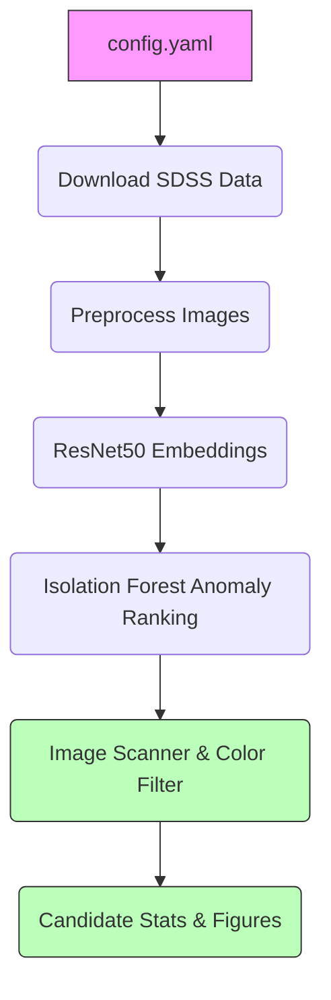

# Hunting Hidden Galaxy Collisions with AI

**Status:** Candidate-generation workflow  
**Scope:** SDSS image preprocessing, embedding-based anomaly ranking, and raw JPG multi-component scanning

## Architecture Diagram



## Quick Start

The pipeline is now fully centralized and driven by `config.yaml`. 

```bash
# 1. Install dependencies
pip install -r requirements.txt

# 2. Configure paths and parameters (Optional)
# Edit config.yaml in the root directory

# 3. Run the entire pipeline end-to-end
python run_pipeline.py

# Alternatively, run via Makefile
make all
```

### Running Individual Stages
If you want to run specific stages, you can use the Makefile commands or their direct Python equivalents:

**Download Data:**
```bash
make data
# Or: python scripts/download_data.py --n 5000
```

**Preprocess Images:**
```bash
make preprocess
# Or: python scripts/preprocess_images.py
```

**Generate ResNet50 Embeddings:**
```bash
make embed
# Or: python scripts/generate_embeddings.py
```
This stage generates `results/intermediate/embeddings/galaxy_embeddings.npy`, which is required by Stage 4 and is expected to be regenerated in a fresh clone.

**Isolation Forest Anomaly Ranking:**
```bash
make anomaly
# Or: python scripts/detect_anomalies.py
```

**Image-Plane Scanner & Photometric Filter:**
```bash
make scan
# Or: python scripts/scan_raw_secondary_sources.py
```

**Compute Pipeline Statistics:**
```bash
make stats
# Or: python scripts/compute_scan_stats.py
```

**Generate Paper Figures:**
```bash
make figures
# Or: python scripts/make_paper_figures.py
```
This script builds the manuscript grid from the highest-ranked available overlays in `raw_object_scan.csv` and writes a `candidate_grid_manifest.csv` alongside the figure.

## Project Structure

| Directory | Purpose |
|-----------|---------|
| `data/raw/` | Downloaded SDSS FITS/images |
| `data/processed/` | Resized, normalized images |
| `data/metadata/` | SDSS catalogs and derived metadata |
| `scripts/` | Pipeline Python stages |
| `results/final/` | **Final outputs** (Filtered catalogs, statistics, and overlay figures) |
| `results/intermediate/` | **Intermediate artifacts** (Embeddings, raw anomaly scores) |
| `results/experimental/` | Scratch space for experimental approaches |
| `memory/` | Internal pipeline JSON state registries |

## Configuration
Pipeline paths and tunable thresholds are configured through `config.yaml`. 
If you wish to change the `sigma_threshold`, `max_color_diff`, or dataset size limits, edit this file before running `run_pipeline.py`.

## Current Constraints

- The repo currently supports **candidate generation**, not discovery confirmation.
- External catalog cross-match and literature review are **not automated end-to-end** here.
- SDSS `objid` entries are already survey-detected objects; absence from a subset of catalogs is not proof of novelty.
- Use outputs as ranked follow-up candidates unless independent verification is added.

## Output Explanation

At the end of a successful run, check `results/final/`:
- `raw_object_scan/raw_object_scan.csv`: The official prioritized list of merging candidates.
- `raw_object_scan/stats.txt`: Summary of reduction counts (e.g. 605 candidates -> 190 high-confidence via color filter).
- `figures/`: Annotated overlays plotting the precise location of the secondary collision components.
