# Visual Inspection Report - 27 ML Candidates

**Date:** 2026-03-10
**Method:** ResNet50 + Isolation Forest (2,048-dim embeddings)
**Candidates:** 27 high-confidence anomalies

---

## Summary Table

| Rank | ObjID | RA (J2000) | Dec (J2000) | Score | Image |
|------|-------|------------|-------------|-------|-------|
| 1 | 12376400000000000608 | 17h02m47.3s | -1d22m29.2s | -0.1355 |  |
| 2 | 12376400000000000518 | 0h22m02.9s | -3d38m46.2s | -0.1197 |  |
| 3 | 12376400000000003407 | 19h01m31.8s | 21d11m35.1s | -0.1138 | 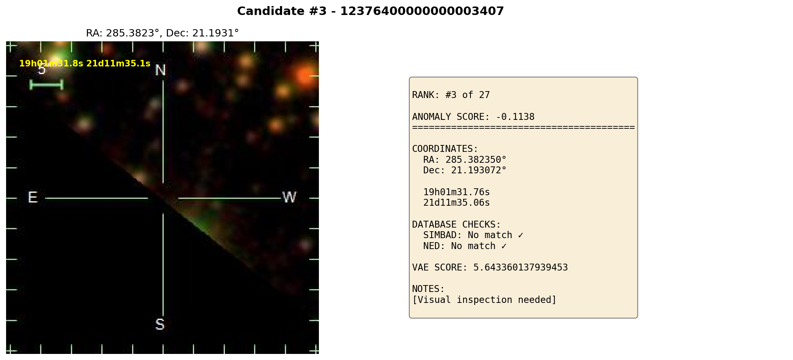 |
| 4 | 12376400000000006055 | 19h40m07.8s | 13d00m09.0s | -0.1010 | 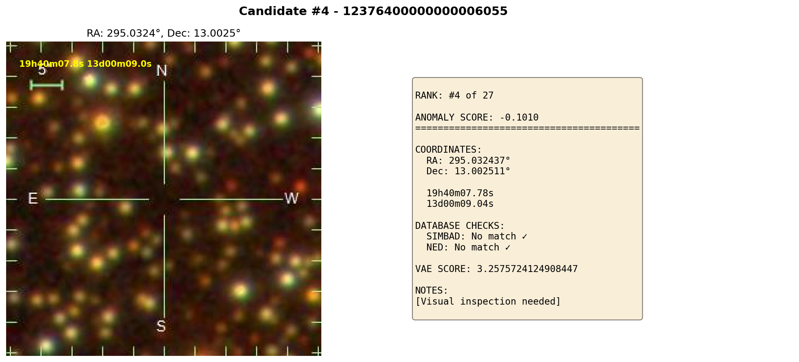 |
| 5 | 12376400000000002823 | 19h37m25.6s | 13d06m47.4s | -0.0977 | 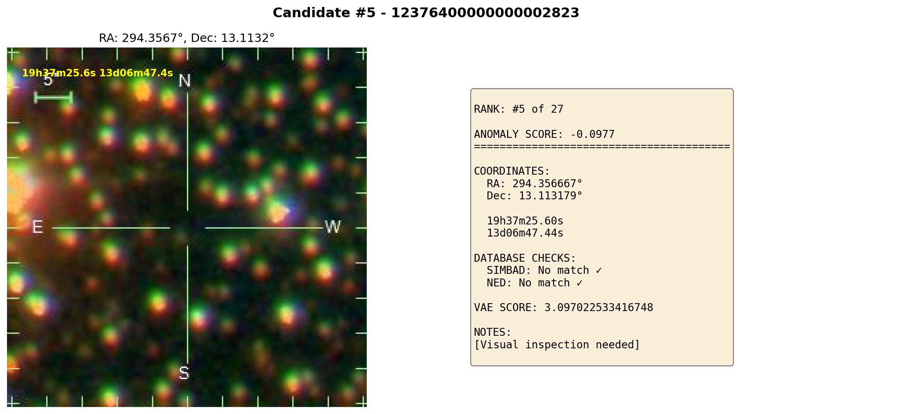 |
| 6 | 12376400000000004438 | 16h44m47.0s | 49d24m27.1s | -0.0908 | 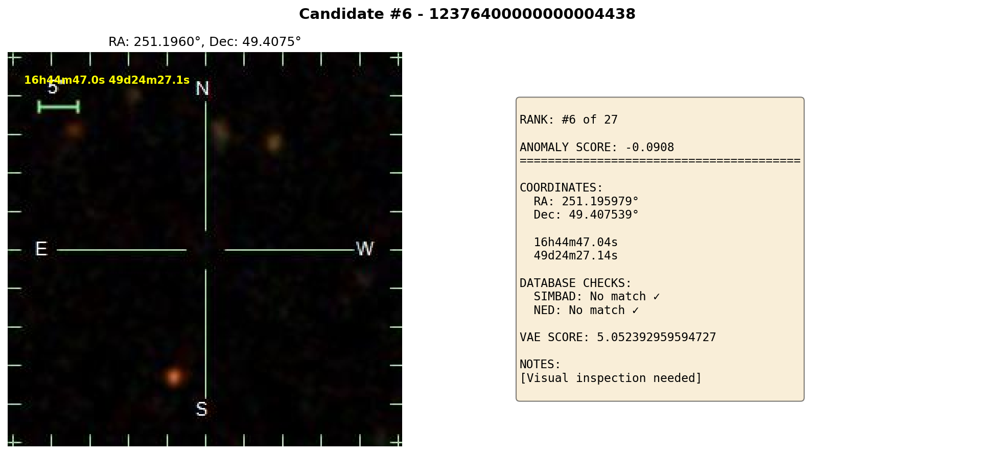 |
| 7 | 12376400000000004558 | 17h11m53.5s | 48d41m28.9s | -0.0899 |  |
| 8 | 12376400000000001679 | 20h28m02.3s | 15d12m16.3s | -0.0891 | 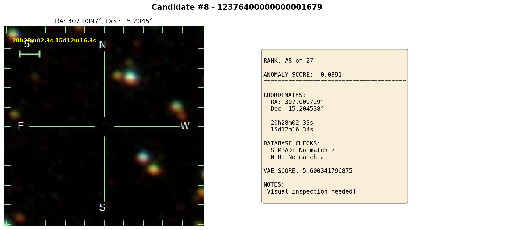 |
| 9 | 12376400000000004539 | 0h34m19.8s | -0d53m24.3s | -0.0861 | 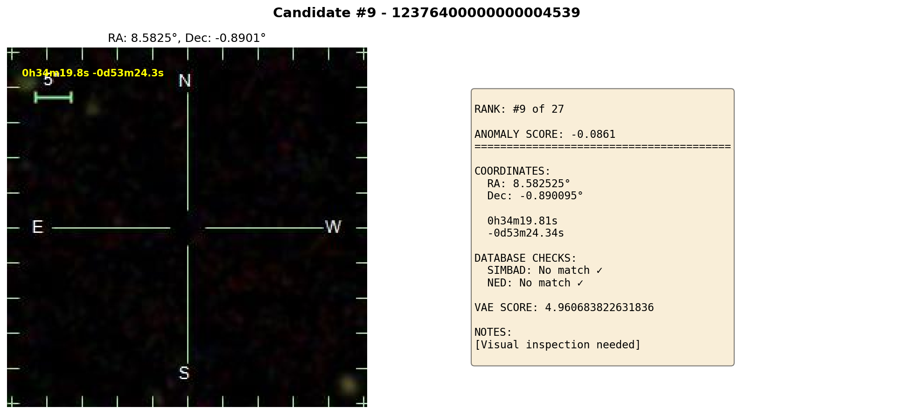 |
| 10 | 12376400000000002551 | 19h13m33.4s | -3d37m40.9s | -0.0855 | 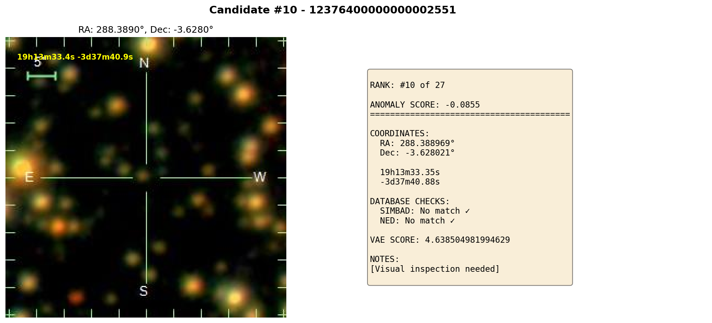 |
| 11 | 12376400000000002817 | 7h23m12.5s | 31d50m13.2s | -0.0852 | 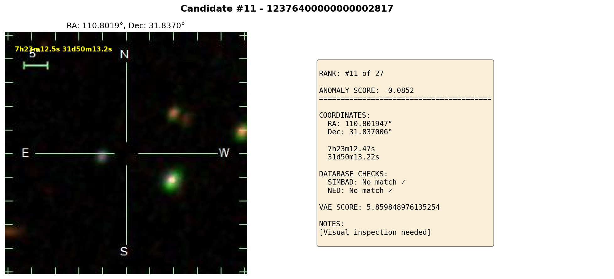 |
| 12 | 12376400000000003968 | 3h59m13.6s | -13d32m19.8s | -0.0849 |  |
| 13 | 12376400000000002711 | 19h11m43.2s | 17d53m51.1s | -0.0830 | 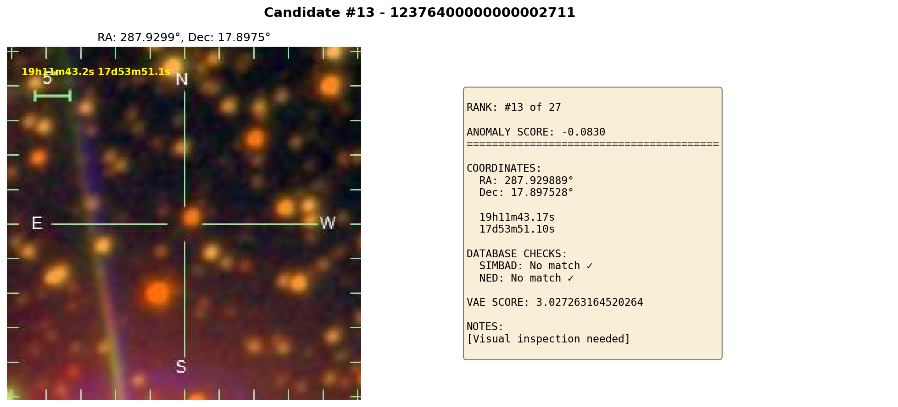 |
| 14 | 12376400000000004018 | 12h21m23.1s | 43d49m36.8s | -0.0790 |  |
| 15 | 12376400000000001375 | 19h51m25.8s | 17d45m20.5s | -0.0788 | 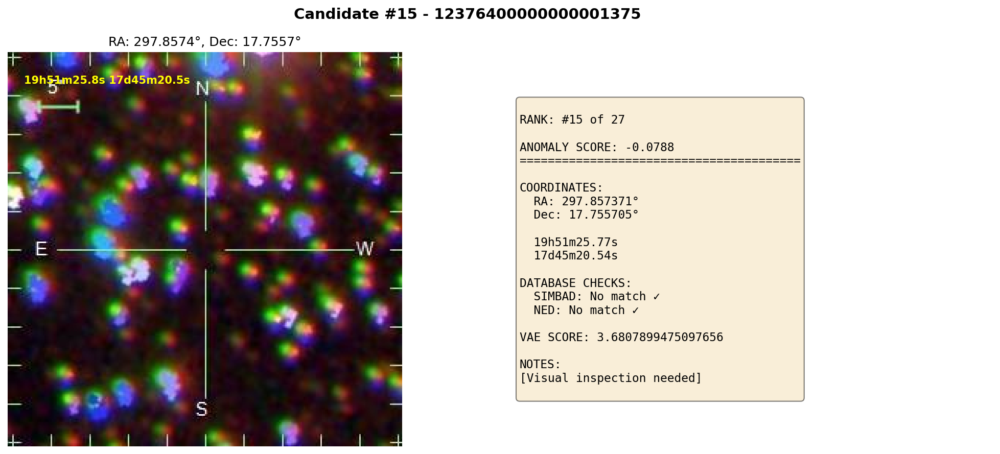 |
| 16 | 12376400000000000250 | 5h09m16.9s | -2d44m01.1s | -0.0776 | 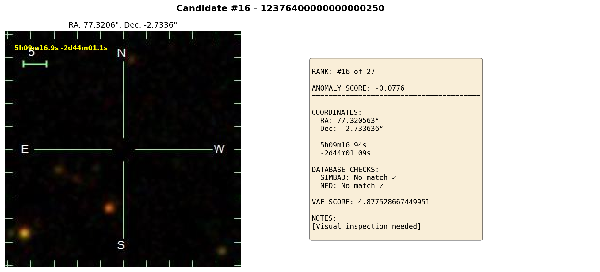 |
| 17 | 12376400000000004088 | 2h45m52.0s | -2d24m30.2s | -0.0771 | 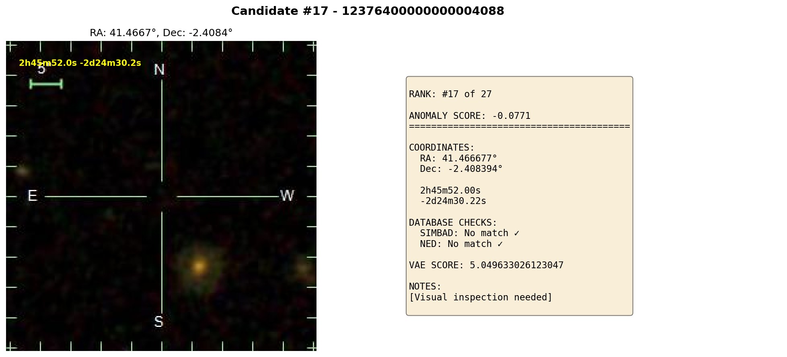 |
| 18 | 12376400000000003558 | 16h35m52.0s | 45d32m02.3s | -0.0688 | 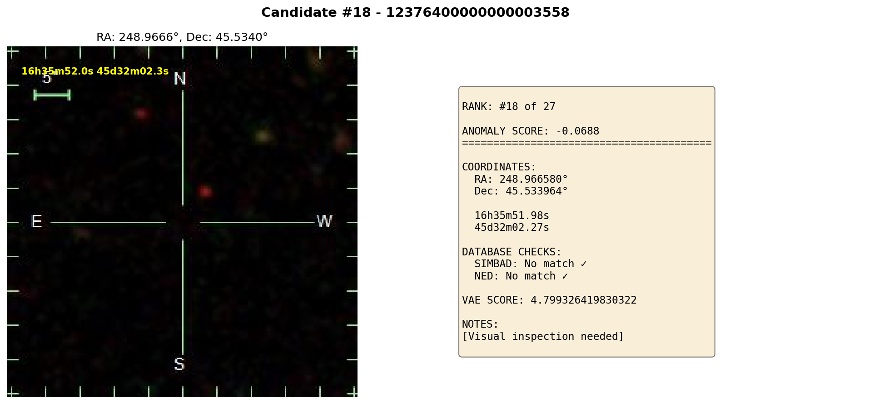 |
| 19 | 12376400000000005655 | 20h08m33.0s | 10d11m03.3s | -0.0670 | 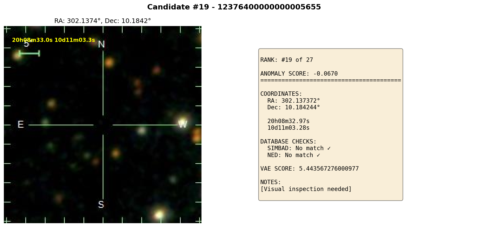 |
| 20 | 12376400000000004348 | 10h59m34.5s | -6d37m22.0s | -0.0668 |  |
| 21 | 12376400000000003127 | 19h53m31.7s | 16d46m44.2s | -0.0666 | 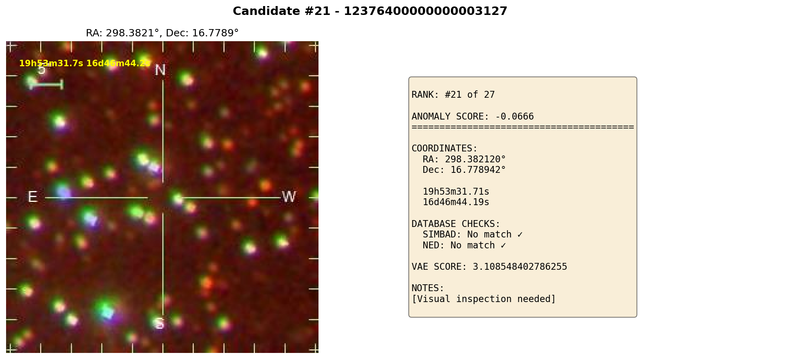 |
| 22 | 12376400000000003738 | 12h14m48.5s | 51d23m29.3s | -0.0636 | 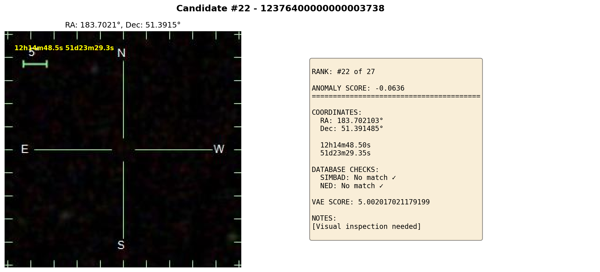 |
| 23 | 12376400000000005887 | 20h06m58.9s | 13d55m31.9s | -0.0606 | 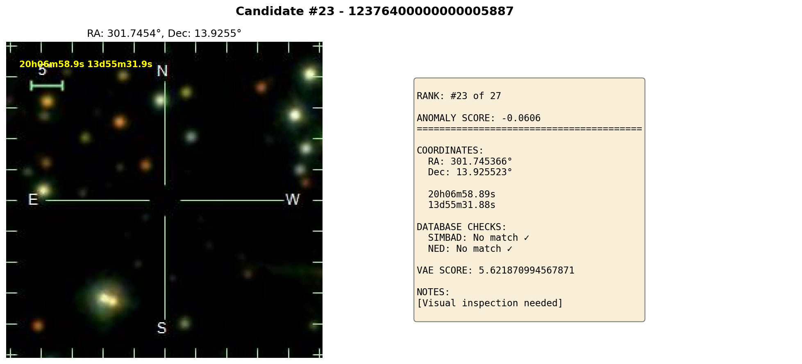 |
| 24 | 12376400000000003431 | 19h35m31.9s | 13d03m08.1s | -0.0606 | 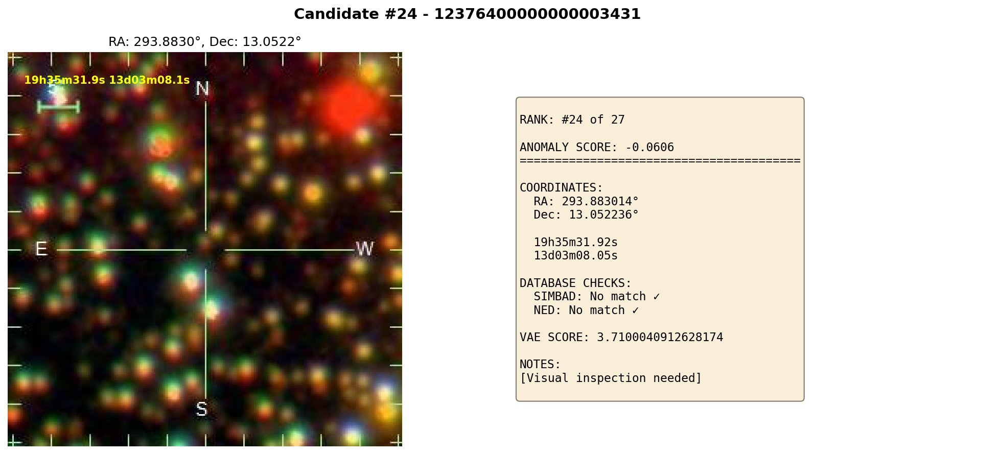 |
| 25 | 12376400000000006143 | 20h05m57.8s | 14d30m15.7s | -0.0530 | 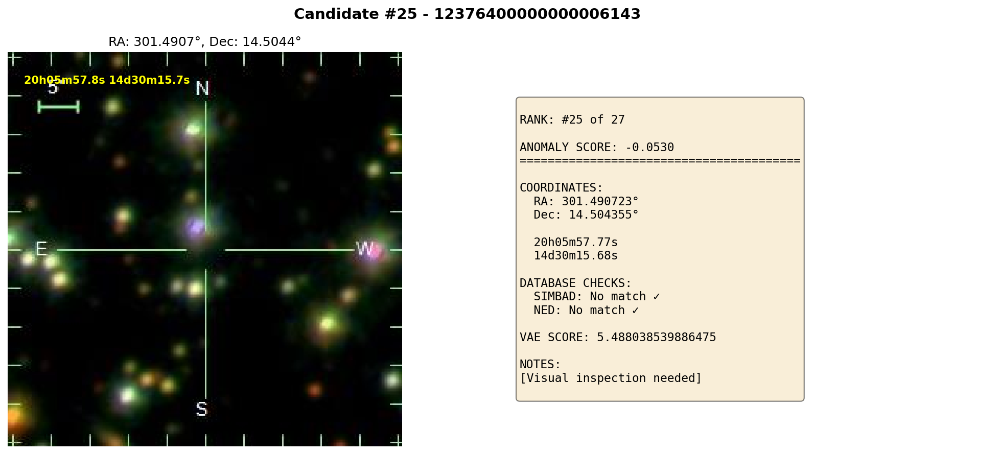 |
| 26 | 12376400000000004898 | 12h35m40.0s | 47d27m11.6s | -0.0527 | 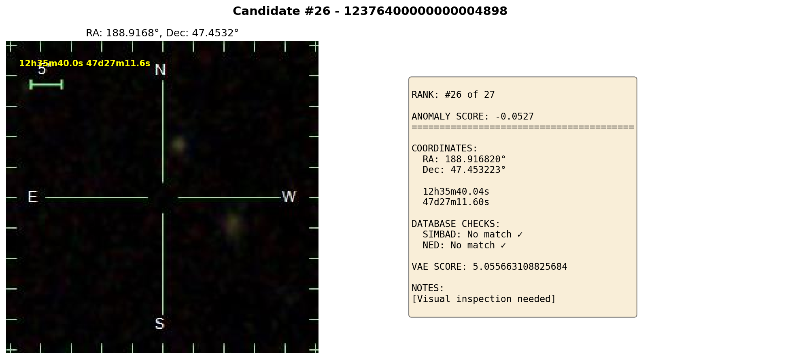 |
| 27 | 12376400000000004808 | 3h21m36.9s | -4d51m14.0s | -0.0512 |  |

---

## Individual Inspection Notes

### Top 10 Priorities

#### #1 - 12376400000000000608
- **Anomaly Score:** -0.1355
- **VAE Score:** 5.0446977615356445
- **Image:** See `candidate_01_12376400000000000608.png`
- **Visual Inspection:** [TO BE FILLED]
  - Galaxy or artifact?
  - Any interesting features?
  - Follow-up priority?

#### #2 - 12376400000000000518
- **Anomaly Score:** -0.1197
- **VAE Score:** 5.330322265625
- **Image:** See `candidate_02_12376400000000000518.png`
- **Visual Inspection:** [TO BE FILLED]
  - Galaxy or artifact?
  - Any interesting features?
  - Follow-up priority?

#### #3 - 12376400000000003407
- **Anomaly Score:** -0.1138
- **VAE Score:** 5.643360137939453
- **Image:** See `candidate_03_12376400000000003407.png`
- **Visual Inspection:** [TO BE FILLED]
  - Galaxy or artifact?
  - Any interesting features?
  - Follow-up priority?

#### #4 - 12376400000000006055
- **Anomaly Score:** -0.1010
- **VAE Score:** 3.2575724124908447
- **Image:** See `candidate_04_12376400000000006055.png`
- **Visual Inspection:** [TO BE FILLED]
  - Galaxy or artifact?
  - Any interesting features?
  - Follow-up priority?

#### #5 - 12376400000000002823
- **Anomaly Score:** -0.0977
- **VAE Score:** 3.097022533416748
- **Image:** See `candidate_05_12376400000000002823.png`
- **Visual Inspection:** [TO BE FILLED]
  - Galaxy or artifact?
  - Any interesting features?
  - Follow-up priority?

#### #6 - 12376400000000004438
- **Anomaly Score:** -0.0908
- **VAE Score:** 5.052392959594727
- **Image:** See `candidate_06_12376400000000004438.png`
- **Visual Inspection:** [TO BE FILLED]
  - Galaxy or artifact?
  - Any interesting features?
  - Follow-up priority?

#### #7 - 12376400000000004558
- **Anomaly Score:** -0.0899
- **VAE Score:** 4.844609260559082
- **Image:** See `candidate_07_12376400000000004558.png`
- **Visual Inspection:** [TO BE FILLED]
  - Galaxy or artifact?
  - Any interesting features?
  - Follow-up priority?

#### #8 - 12376400000000001679
- **Anomaly Score:** -0.0891
- **VAE Score:** 5.600341796875
- **Image:** See `candidate_08_12376400000000001679.png`
- **Visual Inspection:** [TO BE FILLED]
  - Galaxy or artifact?
  - Any interesting features?
  - Follow-up priority?

#### #9 - 12376400000000004539
- **Anomaly Score:** -0.0861
- **VAE Score:** 4.960683822631836
- **Image:** See `candidate_09_12376400000000004539.png`
- **Visual Inspection:** [TO BE FILLED]
  - Galaxy or artifact?
  - Any interesting features?
  - Follow-up priority?

#### #10 - 12376400000000002551
- **Anomaly Score:** -0.0855
- **VAE Score:** 4.638504981994629
- **Image:** See `candidate_10_12376400000000002551.png`
- **Visual Inspection:** [TO BE FILLED]
  - Galaxy or artifact?
  - Any interesting features?
  - Follow-up priority?

---

## Inspection Checklist

For each candidate, check:

- [ ] **Is it a galaxy?** (not a star, artifact, or noise)
- [ ] **Image quality** (not saturated, no cosmic rays)
- [ ] **Position** (not at edge of frame)
- [ ] **Interesting features?** (tails, asymmetries, weird shapes)

### Classification

Mark each candidate as:
- **✓ VALID** - Real galaxy, interesting candidate
- **? UNCLEAR** - Might be galaxy, needs second opinion
- **✗ REJECT** - Artifact, star, or bad data

---

## Results Summary

| Category | Count |
|----------|-------|
| Valid galaxies | _ |
| Unclear | _ |
| Rejected (artifacts) | _ |
| **Total** | **27** |

### Recommendations

**For RNAAS submission:**
- List top _ candidates from visual inspection

**For follow-up:**
- Top _ candidates for spectroscopic observation
